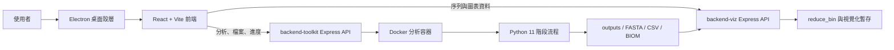

# eDNA WorkBench 專案地圖

這份文件是任何 Markdown 編輯器都能閱讀的專案導覽。專案目前是 **Electron 桌面程式**，以 **React/Vite** 提供介面，並由兩個 **Express** 服務分別負責分析流程與視覺化資料處理。

## 系統架構

## 主要模組

- [`electron/`](../electron/)：啟動桌面視窗、管理本機服務與封裝後的 runtime。
- [`frontend/`](../frontend/)：React UI；包含分析設定、執行進度、結果工具與 Haplotype Network 等功能。
- [`backend-toolkit/`](../backend-toolkit/)：分析 API、上傳／輸出管理、工作狀態、Docker 與 Python pipeline 協調。
- [`backend-viz/`](../backend-viz/)：序列、gene count、ASV reduction 與視覺化資料 API。
- [`backend-toolkit/python_scripts/`](../backend-toolkit/python_scripts/)：實際執行生物資訊處理的 Python scripts。
- [`Dockerfile`](../Dockerfile)：建立分析環境與第三方生物資訊工具。
- [`resources/`](../resources/) 與 [`node-binaries/`](../node-binaries/)：桌面封裝時使用的 Node runtime／資源。
- [`test-data/`](../test-data/)：人工驗證用資料。

## 核心資料流

1. 使用者在 React UI 選擇輸入資料與分析參數。
2. 前端把工作送到 `backend-toolkit`。
3. `backend-toolkit` 建立工作狀態並透過 Docker service 啟動容器。
4. Python executor 依序執行 11 個分析階段並回報進度。
5. 中間檔與最終結果寫入 outputs。
6. 前端讀取分析結果；需要序列整理或圖表資料時再呼叫 `backend-viz`。
7. Electron 將前端、兩個本機服務與必要 runtime 包裝成桌面應用程式。

## 11 階段分析流程

1. `trim and rename`：依 barcode 與品質設定重新命名並修剪 reads。
2. `flash`：用 FLASH 合併 paired-end reads。
3. `length filter`：依最短／最長序列長度過濾。
4. `blast`：對指定 NCBI reference 執行 BLAST。
5. `assign species`：依 keyword 與 identity 門檻指派物種。
6. `species classifier`：整理／分類物種結果。
7. `MAFFT`：進行多序列比對。
8. `tab formatter`：轉換比對結果的表格格式。
9. `trim gaps`：修剪 alignment gaps。
10. `separate reads`：依 copy number 拆分 reads。
11. `generate location-haplotype table`：結合 barcode 產生 location-haplotype 表格。

> 名稱與順序直接取自 `backend-toolkit/src/services/pythonExecutor.js` 的 `standardPipeline`；實際命令在 `backend-toolkit/python_scripts/Step1` 至 `Step6`。

## 前端功能區

- Analysis：建立工作、設定參數、查看進度、停止工作與存取輸出。
- Results／檔案工具：瀏覽、下載及整理 pipeline 結果。
- Haplotype Network：載入序列與地點資訊，建立／格式化 haplotype network 所需資料。
- Visualization：透過 `backend-viz` 轉換、暫存及提供圖表資料。
- Desktop integration：Electron 管理本機 URL、process、資源路徑與跨平台封裝。

## 開發與打包入口

- 開發桌面程式：根目錄 `npm run electron:dev`
- 前端開發：`npm run frontend:dev`
- 前端 production build：`npm run frontend:build`
- 完整桌面 build：`npm run build`
- 發布安裝包：`npm run dist` 或 `npm run dist:all`

目前的 Node.js 版本相容性、測試、lint、核心 runtime 問題與效能待辦，請看 [`docs/technical-debt.md`](technical-debt.md)。
